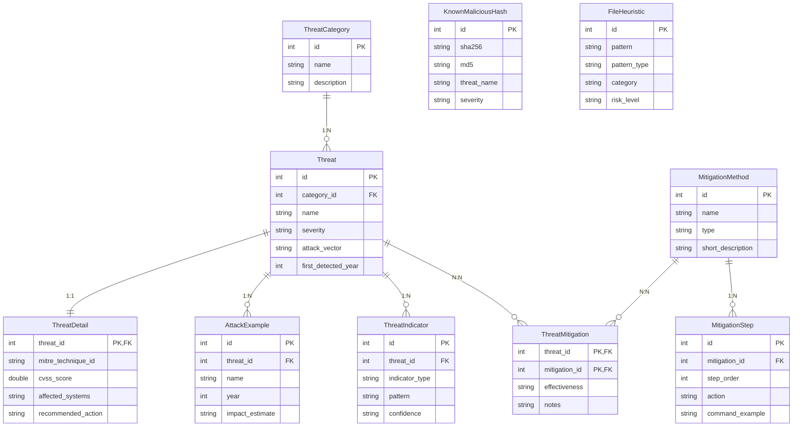

# NetworkThreats — Система классификации сетевых угроз

[](https://dotnet.microsoft.com/)
[](https://blazor.net/)
[](https://learn.microsoft.com/ef/core/)
[](https://www.docker.com/)
[](https://hub.docker.com/r/lisenjik/network-threats-api)
[](https://github.com/Lisi4ka-lis/NetworkThreats)

Веб-приложение для управления базой знаний по сетевым угрозам, методам атак и способам защиты.
Реализован анализатор текста по правилам и статический анализатор загружаемых файлов.

**Репозиторий:** https://github.com/Lisi4ka-lis/NetworkThreats  
**Docker Hub:** https://hub.docker.com/r/lisenjik/network-threats-api  
**Дисциплина:** «Кроссплатформенная среда исполнения программного обеспечения»  
**Кафедра КБ-4** — РТУ МИРЭА

---

## Технологический стек

| Слой | Технология |
|---|---|
| Платформа | .NET 8, ASP.NET Core |
| UI | Blazor Server, Razor Components |
| ORM | Entity Framework Core 8, CodeFirst, Fluent API |
| База данных | SQLite (локально), PostgreSQL (Docker) |
| Кэш | Redis (Docker) / In-Memory (локально) |
| Валидация | FluentValidation 11 + Blazored.FluentValidation |
| Контейнеризация | Docker (multi-stage build), Docker Compose |
| Тестирование | xUnit, Moq, coverlet |
| Стили | Bootstrap 5, Bootstrap Icons, Google Fonts |

---

## Архитектура проекта

```
NetworkThreat/
├── NetworkThreats/                         # ASP.NET Core / Blazor Server проект
│   │
│   ├── Components/
│   │   └── App.razor                       # Корневой Blazor-компонент
│   │
│   ├── Data/
│   │   └── AppDbContext.cs                 # DbContext, Fluent API, HasData seed-данные
│   │
│   ├── Models/                             # EF Core сущности + DTO
│   │   ├── Threat.cs                       # Угроза (центральная сущность)
│   │   ├── ThreatCategory.cs               # Категория угроз          [1:N → Threat]
│   │   ├── ThreatDetail.cs                 # Расширение угрозы         [1:1 ← Threat]
│   │   ├── ThreatMitigation.cs             # Связка угроза–метод       [N:N]
│   │   ├── ThreatIndicator.cs              # Правила текстового анализатора
│   │   ├── MitigationMethod.cs             # Метод защиты
│   │   ├── MitigationStep.cs               # Шаг реализации метода     [1:N → Method]
│   │   ├── AttackExample.cs                # Реальный пример атаки     [1:N → Threat]
│   │   ├── KnownMaliciousHash.cs           # База хэшей вредоносных файлов
│   │   ├── FileHeuristic.cs                # Эвристические правила анализа файлов
│   │   └── Dtos.cs                         # Record-типы (DTO) для передачи данных
│   │
│   ├── Repositories/
│   │   ├── IRepositories.cs                # Интерфейсы: IRepository<T> + специализированные
│   │   └── Repositories.cs                 # Реализации через EF Core + LINQ
│   │
│   ├── Services/
│   │   ├── IServices.cs                    # Интерфейсы бизнес-логики
│   │   └── Services.cs                     # Сервисы: маппинг, анализ, поиск
│   │
│   ├── Validators/
│   │   ├── ThreatValidator.cs              # FluentValidation правила для Threat
│   │   └── ThreatCategoryValidator.cs      # FluentValidation правила для ThreatCategory
│   │
│   ├── Pages/                              # Razor-компоненты (страницы)
│   │   ├── Index.razor                     # /              — Главная, статистика
│   │   ├── ThreatList.razor                # /threats       — Список угроз + модал удаления
│   │   ├── ThreatDetail.razor              # /threats/{id}  — Детальная страница угрозы
│   │   ├── ThreatForm.razor                # /threats/edit  — Форма с FluentValidation
│   │   ├── Categories.razor                # /categories    — Категории + модал создания
│   │   ├── Mitigations.razor               # /mitigations   — Методы защиты
│   │   ├── MitigationDetail.razor          # /mitigations/{id} — Детальная метода
│   │   ├── Search.razor                    # /search        — Полнотекстовый поиск
│   │   ├── Analyzer.razor                  # /analyzer      — Анализатор текста
│   │   └── FileAnalyzer.razor              # /file-analyzer — Анализ файлов
│   │
│   ├── Shared/
│   │   └── MainLayout.razor                # Общий макет: боковая панель + контент
│   │
│   ├── Migrations/                         # EF Core миграции (авто-применяются)
│   │   ├── *_InitialCreate                 # Базовая схема + seed
│   │   ├── *_AddThreatIndicators           # Таблица индикаторов, 51 правило
│   │   ├── *_AddFileAnalysis               # Хэши и эвристика файлов
│   │   └── *_AddThreatDetails              # 1:1 расширение угроз (MITRE, CVSS)
│   │
│   ├── wwwroot/css/site.css                # Дизайн-система (CSS-переменные, тема)
│   ├── _Imports.razor                      # Глобальные @using для всех компонентов
│   ├── NavMenu.razor                       # Навигационная боковая панель
│   ├── Program.cs                          # DI-регистрация, middleware, авто-миграции
│   ├── appsettings.json                    # Строка подключения, логирование
│   └── NetworkThreats.csproj               # Зависимости проекта
│
├── NetworkThreats.Tests/                   # Проект unit-тестов
│   ├── ThreatAnalyzerServiceTests.cs       # 16 тестов анализатора текста
│   ├── FileAnalyzerServiceTests.cs         # 12 тестов анализатора файлов
│   ├── ThreatServiceTests.cs               # 9 тестов сервиса угроз
│   ├── CategoryServiceTests.cs             # 7 тестов сервиса категорий
│   ├── MitigationServiceTests.cs           # 8 тестов сервиса методов защиты
│   ├── SearchServiceTests.cs               # 9 тестов сервиса поиска
│   └── NetworkThreats.Tests.csproj
│
├── Dockerfile                              # Multi-stage: sdk:8.0 → aspnet:8.0
├── docker-compose.yml                      # 3 сервиса: app + PostgreSQL + Redis
├── .dockerignore                           # Исключения для Docker build context
└── .editorconfig                           # Единые правила форматирования C#/Razor
```

---

## Схема базы данных

### ER-диаграмма (Mermaid)



### Типы отношений

| Отношение | Сущности | Реализация |
|---|---|---|
| **1:N** | `ThreatCategory` → `Threat` | `HasOne.WithMany` + FK `category_id` |
| **1:N** | `Threat` → `AttackExample` | `HasOne.WithMany` + FK `threat_id` |
| **1:N** | `Threat` → `ThreatIndicator` | `HasOne.WithMany` + FK `threat_id` |
| **1:N** | `MitigationMethod` → `MitigationStep` | `HasOne.WithMany` + FK `mitigation_id` |
| **1:1** | `Threat` ↔ `ThreatDetail` | `HasOne.WithOne`, `ThreatId` — PK и FK |
| **N:N** | `Threat` ↔ `MitigationMethod` | Таблица `ThreatMitigation` с атрибутами |

---

## Миграции

| Миграция | Содержимое |
|---|---|
| `InitialCreate` | Все основные таблицы, связи, seed-данные (угрозы, категории, методы) |
| `AddThreatIndicators` | Таблица `threat_indicators`, 51 правило для анализатора |
| `AddFileAnalysis` | Таблицы `known_malicious_hashes` и `file_heuristics`, seed-данные |
| `AddThreatDetails` | Таблица `threat_details` (1:1), MITRE и CVSS для 10 угроз |

Миграции применяются **автоматически** при каждом запуске через `db.Database.Migrate()` в `Program.cs`.  
В Docker (PostgreSQL) схема создаётся через `db.Database.EnsureCreated()`.

---

## Функциональность

| Раздел | Описание |
|---|---|
| **Главная** | Статистика: кол-во угроз, категорий, методов защиты |
| **Угрозы** | Список с фильтрацией по категории и критичности, удаление через модальное окно |
| **Детальная угрозы** | Описание, MITRE ATT&CK, CVSS, реальные атаки, методы защиты |
| **Форма угрозы** | Создание/редактирование с валидацией FluentValidation (per-field сообщения) |
| **Категории** | Карточки категорий, добавление новой категории через модальное окно |
| **Методы защиты** | Список с фильтрацией по типу (preventive / detective / corrective) |
| **Детальная метода** | Шаги реализации, список закрываемых угроз |
| **Поиск** | Полнотекстовый поиск по угрозам, категориям и методам |
| **Анализатор текста** | Поиск совпадений с индикаторами угроз (keyword, regex, domain, filepath) |
| **Анализ файлов** | SHA-256/MD5 хэш-сверка, эвристика, извлечение строк |

---

## Ограничения инструментов анализа

### Анализатор текста (`/analyzer`)

Анализатор сопоставляет введённый текст с индикаторами угроз, хранящимися в базе данных (`ThreatIndicator`). Из-за статической природы правил возможности инструмента ограничены:

| Ограничение | Описание |
|---|---|
| **Только известные индикаторы** | Обнаруживаются исключительно угрозы, для которых в БД существуют записи `ThreatIndicator`. Новые или неизвестные техники атак будут пропущены. |
| **Нет контекстного понимания** | Совпадение по ключевому слову или регулярному выражению происходит без учёта смысла предложения. Одно слово может дать ложноположительный результат в нейтральном тексте. |
| **Ограниченный набор типов** | Поддерживаются четыре типа индикаторов: `keyword`, `regex`, `domain`, `filepath`. Индикаторы других форматов (IP-диапазоны, сигнатуры протоколов и т. д.) не обрабатываются. |
| **Нет семантического анализа** | Перефразированный или закодированный (Base64, hex-escape) текст атаки не идентифицируется. |
| **Зависимость от актуальности БД** | Качество анализа напрямую определяется полнотой и свежестью записей в `ThreatIndicator`. Устаревшая база снижает точность обнаружения. |
| **Отсутствие машинного обучения** | Правила созданы вручную; инструмент не адаптируется к новым паттернам угроз без явного обновления записей в БД. |
| **Только текстовый ввод** | Анализируется исключительно введённый пользователем текст; сетевой трафик, логи или бинарные данные напрямую не поддерживаются. |

### Анализатор файлов (`/file-analyzer`)

Анализатор файлов выполняет три проверки: сверку хэшей с базой `KnownMaliciousHash`, применение эвристических правил `FileHeuristic` и извлечение строк. Каждая из них имеет принципиальные ограничения:

| Ограничение | Описание |
|---|---|
| **Хэш-сверка — только известные образцы** | Совпадение возможно лишь при точном совпадении SHA-256 или MD5. Любое изменение файла (переупаковка, дополнение байтами) полностью меняет хэш и обходит проверку. |
| **Не обнаруживает полиморфное и метаморфное вредоносное ПО** | Малвара, изменяющая собственный код при каждом заражении, не попадёт в базу фиксированных хэшей. |
| **Статические эвристики — нет поведенческого анализа** | Правила `FileHeuristic` основаны на паттернах внутри файла. Файл, вредоносные действия которого проявляются только во время исполнения (обращение к сети, инъекция в процесс), не будет помечен. |
| **Не поддерживает зашифрованный и упакованный контент** | Содержимое файла, упакованного кастомным упаковщиком или зашифрованного, недоступно для статической проверки до распаковки. |
| **Извлечение строк — поверхностный метод** | Из файла извлекаются только печатаемые ASCII-последовательности. Obfuscated-строки, многобайтовые кодировки и динамически собираемые строки в памяти не обнаруживаются. |
| **Нет sandbox-анализа** | Файл не запускается и не эмулируется; поведение в изолированной среде не проверяется. |
| **Зависимость от актуальности баз** | Как и в анализаторе текста, качество результата определяется своевременным обновлением таблиц `KnownMaliciousHash` и `FileHeuristic`. |
| **Zero-day угрозы не покрываются** | Эксплойты и вредоносные файлы, о которых отсутствуют сведения в базах хэшей и правилах, будут пропущены. |
| **Ограничения по размеру и типу файла** | Очень большие файлы могут повлиять на время отклика; специфические форматы (контейнеры, прошивки, зашифрованные архивы) требуют специализированных парсеров. |

> **Рекомендация.** Оба инструмента предназначены для первичного и вспомогательного анализа в учебных и исследовательских целях. Для продуктивного применения необходимо регулярно обновлять базы индикаторов и хэшей, дополнять статический анализ динамическим (sandbox), а также использовать специализированные SIEM- и EDR-решения.

---

## Тестирование

Unit-тесты реализованы с использованием **xUnit** и **Moq** (мокирование репозиториев).

| Класс тестов | Тестов | Покрытие |
|---|---|---|
| `ThreatAnalyzerServiceTests` | 16 | Keyword/regex совпадения, группировка, сортировка, метки типов |
| `FileAnalyzerServiceTests` | 12 | Хэш-сверка, эвристика, извлечение строк, приоритет риска |
| `ThreatServiceTests` | 9 | Маппинг в DTO, фильтрация, CRUD делегация |
| `CategoryServiceTests` | 7 | Счётчик угроз в DTO, CRUD делегация |
| `MitigationServiceTests` | 8 | Маппинг, фильтрация по типу, CRUD |
| `SearchServiceTests` | 9 | Агрегация, URL/тип результатов, граничные случаи |
| **Итого** | **61** | **97.3% lines / 87.1% branches / 100% methods** |

```bash
# Запуск тестов
dotnet test NetworkThreats.Tests/NetworkThreats.Tests.csproj

# С отчётом покрытия
dotnet test NetworkThreats.Tests/NetworkThreats.Tests.csproj /p:CollectCoverage=true /p:CoverletOutputFormat=lcov /p:CoverletOutput=./coverage/
```

---

## Установка и запуск

### Требования

- [.NET 8 SDK](https://dotnet.microsoft.com/download/dotnet/8.0)
- [Docker Desktop](https://www.docker.com/products/docker-desktop/) *(для запуска через Docker)*

### Локально (SQLite)

```bash
# 1. Клонировать репозиторий
git clone https://github.com/Lisi4ka-lis/NetworkThreats.git
cd NetworkThreats

# 2. Восстановить зависимости
dotnet restore NetworkThreats/NetworkThreats.csproj

# 3. Запустить приложение (миграции применяются автоматически)
dotnet run --project NetworkThreats
```

Приложение: **http://localhost:5000**

### Через Docker Compose (рекомендуется)

Запускает три контейнера: приложение + PostgreSQL + Redis.

```bash
# Сборка и запуск
docker-compose up -d --build

# Просмотр логов
docker-compose logs -f

# Остановка (данные БД сохраняются)
docker-compose down
```

Приложение: **http://localhost:8080**  
Данные PostgreSQL сохраняются в именованном томе `pg_data`.

### Готовый образ с Docker Hub

```bash
docker pull lisenjik/network-threats-api:latest

docker run -d -p 8080:8080 --name networkthreats lisenjik/network-threats-api:latest
```

Образ: **https://hub.docker.com/r/lisenjik/network-threats-api**

---

## Конфигурация

| Параметр | По умолчанию | Описание |
|---|---|---|
| `ConnectionStrings:DefaultConnection` | `Data Source=networkthreats.db` | SQLite локально; `Host=...` → PostgreSQL |
| `ConnectionStrings:Redis` | *(пусто)* | Адрес Redis; пусто → in-memory кэш |
| `ASPNETCORE_ENVIRONMENT` | `Development` | Среда выполнения |
| `ASPNETCORE_URLS` | `http://+:8080` | Порт в контейнере |

Провайдер БД определяется автоматически: если строка подключения содержит `Host=` — используется PostgreSQL, иначе SQLite.

---

## Маршруты приложения

| URL | Страница |
|---|---|
| `/` | Главная |
| `/threats` | Список угроз |
| `/threats?categoryId={id}` | Угрозы по категории |
| `/threats/{id}` | Детальная страница угрозы |
| `/threats/create` | Создание угрозы |
| `/threats/{id}/edit` | Редактирование угрозы |
| `/categories` | Категории |
| `/mitigations` | Методы защиты |
| `/mitigations/{id}` | Детальная страница метода |
| `/search` | Полнотекстовый поиск |
| `/analyzer` | Анализатор текста |
| `/file-analyzer` | Анализ файлов |
