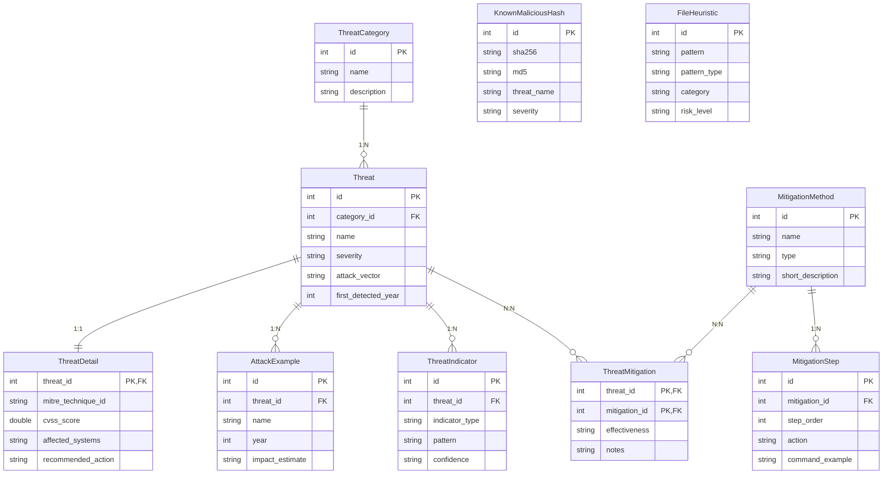

# NetworkThreats — Система классификации сетевых угроз

Веб-приложение для управления базой знаний по сетевым угрозам, методам атак и способам защиты.
Реализован анализатор текста по правилам и статический анализатор загружаемых файлов.

**Дисциплина:** «Кроссплатформенная среда исполнения программного обеспечения»  
**Кафедра КБ-4** — РТУ МИРЭА

---

## Технологический стек

| Слой | Технология |
|---|---|
| Платформа | .NET 8, ASP.NET Core |
| UI | Blazor Server, Razor Components |
| ORM | Entity Framework Core 8, CodeFirst, Fluent API |
| База данных | SQLite (переопределяется через env-переменную) |
| Контейнеризация | Docker (multi-stage build), Docker Compose |
| Стили | Bootstrap 5, Bootstrap Icons, Google Fonts |

---

## Архитектура проекта

```
NetworkThreat/
├── NetworkThreats/                         # ASP.NET Core / Blazor Server проект
│   │
│   ├── Components/
│   │   └── App.razor                       # Корневой Blazor-компонент
│   │
│   ├── Data/
│   │   └── AppDbContext.cs                 # DbContext, Fluent API, HasData seed-данные
│   │
│   ├── Models/                             # EF Core сущности + DTO
│   │   ├── Threat.cs                       # Угроза (центральная сущность)
│   │   ├── ThreatCategory.cs               # Категория угроз          [1:N → Threat]
│   │   ├── ThreatDetail.cs                 # Расширение угрозы         [1:1 ← Threat]
│   │   ├── ThreatMitigation.cs             # Связка угроза–метод       [N:N]
│   │   ├── ThreatIndicator.cs              # Правила текстового анализатора
│   │   ├── MitigationMethod.cs             # Метод защиты
│   │   ├── MitigationStep.cs               # Шаг реализации метода     [1:N → Method]
│   │   ├── AttackExample.cs                # Реальный пример атаки     [1:N → Threat]
│   │   ├── KnownMaliciousHash.cs           # База хэшей вредоносных файлов
│   │   ├── FileHeuristic.cs                # Эвристические правила анализа файлов
│   │   └── Dtos.cs                         # Record-типы (DTO) для передачи данных
│   │
│   ├── Repositories/
│   │   ├── IRepositories.cs                # Интерфейсы: IRepository<T> + специализированные
│   │   └── Repositories.cs                 # Реализации через EF Core + LINQ
│   │
│   ├── Services/
│   │   ├── IServices.cs                    # Интерфейсы бизнес-логики
│   │   └── Services.cs                     # Сервисы: маппинг, анализ, поиск
│   │
│   ├── Pages/                              # Razor-компоненты (страницы)
│   │   ├── Index.razor                     # /            — Главная, статистика
│   │   ├── ThreatList.razor                # /threats     — Список угроз с фильтрами
│   │   ├── ThreatDetail.razor              # /threats/{id}— Детальная страница угрозы
│   │   ├── ThreatForm.razor                # /threats/edit— Форма создания/редактирования
│   │   ├── Categories.razor                # /categories  — Категории угроз
│   │   ├── Mitigations.razor               # /mitigations — Методы защиты
│   │   ├── MitigationDetail.razor          # /mitigations/{id} — Детальная метода
│   │   ├── Search.razor                    # /search      — Полнотекстовый поиск
│   │   ├── Analyzer.razor                  # /analyzer    — Анализатор текста
│   │   └── FileAnalyzer.razor              # /file-analyzer — Анализ файлов
│   │
│   ├── Shared/
│   │   └── MainLayout.razor                # Общий макет: боковая панель + контент
│   │
│   ├── Migrations/                         # EF Core миграции (авто-применяются)
│   │   ├── *_InitialCreate                 # Базовая схема + seed
│   │   ├── *_AddThreatIndicators           # Таблица индикаторов, 51 правило
│   │   ├── *_AddFileAnalysis               # Хэши и эвристика файлов
│   │   └── *_AddThreatDetails              # 1:1 расширение угроз (MITRE, CVSS)
│   │
│   ├── wwwroot/
│   │   └── css/
│   │       └── site.css                    # Дизайн-система (CSS-переменные, тема)
│   │
│   ├── _Imports.razor                      # Глобальные @using для всех компонентов
│   ├── NavMenu.razor                       # Навигационная боковая панель
│   ├── Program.cs                          # DI-регистрация, middleware, авто-миграции
│   ├── appsettings.json                    # Строка подключения, логирование
│   └── NetworkThreats.csproj               # Зависимости проекта
│
├── Dockerfile                              # Multi-stage: sdk:8.0 → aspnet:8.0
├── docker-compose.yml                      # Сервис app + том db_data для SQLite
└── .editorconfig                           # Единые правила форматирования C#/Razor
```

---

## Схема базы данных

### ER-диаграмма (Mermaid)



### Типы отношений

| Отношение | Сущности | Реализация |
|---|---|---|
| **1:N** | `ThreatCategory` → `Threat` | `HasOne.WithMany` + FK `category_id` |
| **1:N** | `Threat` → `AttackExample` | `HasOne.WithMany` + FK `threat_id` |
| **1:N** | `Threat` → `ThreatIndicator` | `HasOne.WithMany` + FK `threat_id` |
| **1:N** | `MitigationMethod` → `MitigationStep` | `HasOne.WithMany` + FK `mitigation_id` |
| **1:1** | `Threat` ↔ `ThreatDetail` | `HasOne.WithOne`, `ThreatId` — PK и FK |
| **N:N** | `Threat` ↔ `MitigationMethod` | Таблица `ThreatMitigation` с атрибутами |

---

## Миграции

| Миграция | Содержимое |
|---|---|
| `InitialCreate` | Все основные таблицы, связи, seed-данные (угрозы, категории, методы) |
| `AddThreatIndicators` | Таблица `threat_indicators`, 51 правило для анализатора |
| `AddFileAnalysis` | Таблицы `known_malicious_hashes` и `file_heuristics`, seed-данные |
| `AddThreatDetails` | Таблица `threat_details` (1:1), MITRE и CVSS для 10 угроз |

Миграции применяются **автоматически** при каждом запуске через `db.Database.Migrate()` в `Program.cs`.

---

## Функциональность

| Раздел | Описание |
|---|---|
| **Главная** | Статистика: кол-во угроз, категорий, методов защиты |
| **Угрозы** | Список с фильтрацией по категории и критичности |
| **Детальная угрозы** | Описание, MITRE ATT&CK, CVSS, реальные атаки, методы защиты |
| **Категории** | Карточки категорий, клик фильтрует список угроз |
| **Методы защиты** | Список с фильтрацией по типу (preventive/detective/corrective) |
| **Детальная метода** | Шаги реализации, список закрываемых угроз |
| **Поиск** | Полнотекстовый поиск по угрозам, категориям и методам |
| **Анализатор текста** | Поиск совпадений с индикаторами угроз (keyword, regex, domain, filepath) |
| **Анализ файлов** | SHA-256/MD5 хэш-сверка, эвристика, извлечение строк |

---

## Установка и запуск

### Требования

- [.NET 8 SDK](https://dotnet.microsoft.com/download/dotnet/8.0)
- [Docker Desktop](https://www.docker.com/products/docker-desktop/) *(для запуска через Docker)*

### Локально

```bash
# 1. Клонировать репозиторий
git clone https://github.com/username/NetworkThreats.git
cd NetworkThreats

# 2. Восстановить зависимости
dotnet restore NetworkThreats/NetworkThreats.csproj

# 3. Применить миграции и создать БД
dotnet ef database update --project NetworkThreats

# 4. Запустить приложение
dotnet run --project NetworkThreats
```

Приложение откроется по адресу: **https://localhost:7001** (или http://localhost:5001)

> Миграции применяются автоматически при запуске — шаг 3 можно пропустить.

### Через Docker Compose (рекомендуется)

```bash
# Сборка образа и запуск контейнера
docker-compose up -d --build

# Просмотр логов
docker-compose logs -f

# Остановка
docker-compose down
```

Приложение: **http://localhost:8080**  
База данных сохраняется в именованном томе `db_data` и не теряется при перезапуске.

### Только Docker (без Compose)

```bash
# Собрать образ
docker build -t networkthreats:latest .

# Запустить контейнер с сохранением БД
docker run -d \
  -p 8080:8080 \
  -v networkthreats_data:/app/data \
  --name networkthreats \
  networkthreats:latest
```

---

## Конфигурация

| Параметр | По умолчанию | Описание |
|---|---|---|
| `ConnectionStrings:DefaultConnection` | `Data Source=networkthreats.db` | Путь к SQLite-файлу |
| `ASPNETCORE_ENVIRONMENT` | `Development` | Среда выполнения |
| `ASPNETCORE_URLS` | `http://+:8080` | Порт в контейнере |

Для переопределения строки подключения в Docker:
```yaml
environment:
  - ConnectionStrings__DefaultConnection=Data Source=/app/data/custom.db
```

---

## Маршруты приложения

| URL | Страница |
|---|---|
| `/` | Главная |
| `/threats` | Список угроз |
| `/threats?categoryId={id}` | Угрозы по категории |
| `/threats/{id}` | Детальная страница угрозы |
| `/threats/{id}/edit` | Редактирование угрозы |
| `/categories` | Категории |
| `/mitigations` | Методы защиты |
| `/mitigations/{id}` | Детальная страница метода |
| `/search` | Полнотекстовый поиск |
| `/analyzer` | Анализатор текста |
| `/file-analyzer` | Анализ файлов |
